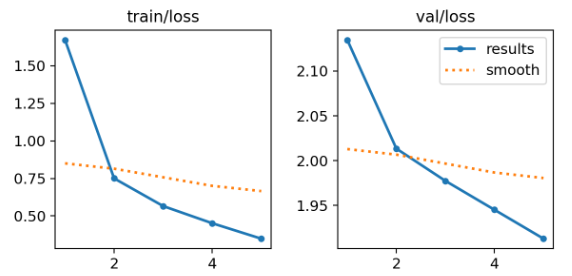
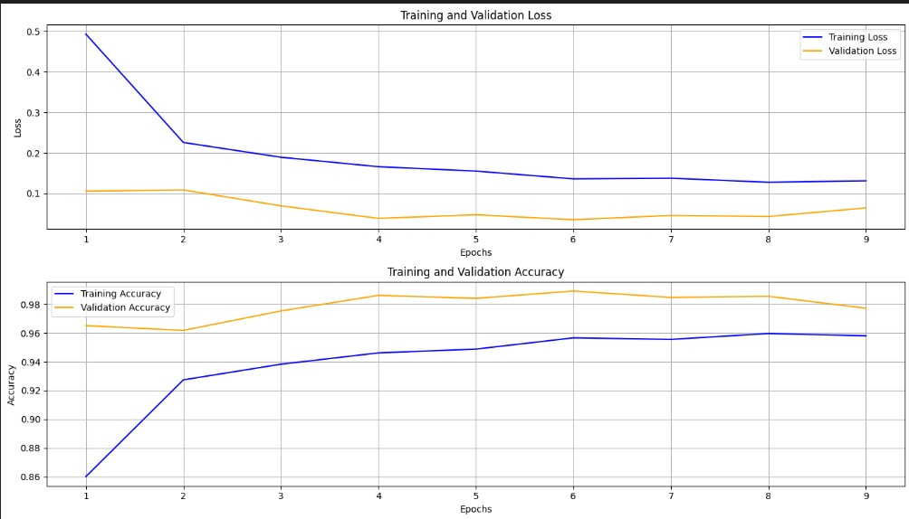
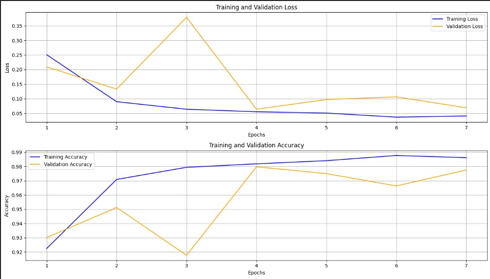
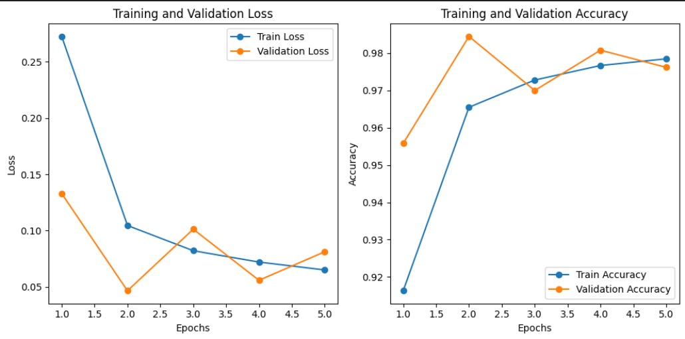

# 🌱 Crop Disease Detection: YOLOv11 vs CNN-based Models

This project performs a comparative study of object detection and image classification techniques for crop disease identification using image data from the **PlantVillage** dataset. Specifically, it evaluates the performance of **YOLOv11** for object detection against CNN-based image classifiers — **EfficientNetB0**, **ResNet50**, and **MobileNetV2** — across 15 healthy and diseased categories for 3 common crops.

The objective is to analyze the strengths and limitations of object detection versus traditional classification approaches for this task. All models were trained and tested on a balanced and augmented subset of the PlantVillage dataset, and their performance was measured using accuracy, precision, and recall on the training, validation and testing subsets.

---

## 📁 Dataset

This project uses the [**PlantVillage** dataset](https://www.kaggle.com/datasets/emmarex/plantdisease), a widely used benchmark in crop disease detection research. The dataset consists of over **54,000 labeled images** of leaves across **38 distinct classes**, categorized by species and disease (including multiple diseases per crop). In our project, we have classified across 15 different classes for some popular crops like bell peppers, tomatoes and potatoes for multiple diseases along with a class for healthy leaves too. 

### Key Details:
- **Original dataset link**: [spMohanty GitHub](https://github.com/spMohanty/PlantVillage-Dataset/tree/master) 
- **Original dataset size**: 54,000+ images  
- **Image format**: RGB, Greyscale, segmented. Here, we have used RGB images in JPG format.
- **Classes used for this project**: 15 classes across 3 crops (Bell pepper, tomato, and potato) for both healthy and diseased leaves

---

### 🔧 Preprocessing & Augmentation

To improve generalization and balance class distribution, the following preprocessing steps were applied:

- **Image Augmentation**:
  - Random horizontal flipping
  - Random rotations up to ±15 degrees
  - Color jitter (brightness, contrast, saturation adjustments)
  - Random resized cropping to **224×224** resolution
  - Conversion to tensor format

- **Dataset Balancing**:
  - Each class was upsampled to a uniform target count using augmented copies of underrepresented classes.
  - Original and augmented images were combined to ensure equal representation across classes.

- **Train-Validation-Test Split**:
  - The dataset was split into **training**, **validation**, and **test** sets using a class-wise stratified approach.
  - Typical splits used: `70%` training, `15%` validation, and `15%` test.

---

## 🧠 Models Used

This project benchmarks the performance of **YOLOv11** as a classification model against widely used **CNN** architectures — **EfficientNetB0**, **ResNet50**, and **MobileNetV2** — on the PlantVillage crop disease dataset.

### 🔷 YOLOv11 (for Classification)
Though primarily known for object detection, **YOLOv11** was adapted and trained here as an image classifier to evaluate its performance in crop disease recognition. It processes the entire image and outputs class predictions without any bounding box localization.

- **Why YOLOv11**: To test its feature extraction capabilities in comparison to traditional CNNs  
- **Advantage**: Fast inference and compact architecture suitable for low-latency applications

### 🔶 CNN Baselines
To establish comparative performance, we evaluated the following pre-trained CNNs:

- **EfficientNetB0**: Known for state-of-the-art accuracy with fewer parameters, using compound model scaling  
- **ResNet50**: A deeper architecture leveraging residual connections to reduce vanishing gradient issues  
- **MobileNetV2**: Lightweight and optimized for deployment on mobile/edge devices, using inverted residuals

---

## 📋Results

The training, validation and test accuracies for each model have been described below.

| Models         | Train Acc | Val Acc | Test Acc | 
|---------------|-----------|---------|----------|
| **YOLOv11**       | 99.9%     | 99.9%   | 99.9%    |
| **EfficientNetB0**| 95.81%     | 97.73%   | 97.61%    |
| **ResNet50**      | 98.61%    | 97.75%    | 98.09%  | 
| **MobileNetV2**   | 97.85%     | 97.62%   | 98.09%   |

### 🔹 Training and Validation Curves

The following graphs display the training and validation curves against the number of epochs for the implemented models. The confusion matrices for each model have been provided in the [Results folder](Results) for better clarity. 
 

  
  &nbsp;&nbsp;&nbsp;&nbsp;&nbsp;&nbsp;
  

  <em>YOLOv11 Curves</em>  
  &nbsp;&nbsp;&nbsp;&nbsp;&nbsp;&nbsp; &nbsp; &nbsp; &nbsp; &nbsp; &nbsp; &nbsp;&nbsp;&nbsp;&nbsp;&nbsp; &nbsp;&nbsp;&nbsp;&nbsp;&nbsp;&nbsp;&nbsp;&nbsp; &nbsp;&nbsp;
  <em>&nbsp;&nbsp;&nbsp;&nbsp;&nbsp;&nbsp;&nbsp;&nbsp;&nbsp;&nbsp;&nbsp;&nbsp;&nbsp;&nbsp;&nbsp;&nbsp;&nbsp;&nbsp;&nbsp;EfficientNetB0 Curves</em>

 

  
  &nbsp;&nbsp;&nbsp;&nbsp;&nbsp;&nbsp;
  

  <em>MobileNetV2 Curves</em>
   &nbsp;&nbsp;&nbsp;&nbsp;&nbsp;&nbsp; &nbsp; &nbsp; &nbsp; &nbsp; &nbsp; &nbsp;&nbsp;&nbsp;&nbsp;&nbsp; &nbsp;&nbsp;&nbsp;&nbsp;&nbsp;&nbsp;&nbsp;&nbsp; &nbsp;&nbsp;
  <em>&nbsp;&nbsp;&nbsp;&nbsp;&nbsp;&nbsp;&nbsp;&nbsp;&nbsp;&nbsp;&nbsp;&nbsp;&nbsp;&nbsp;&nbsp;&nbsp;&nbsp;&nbsp;&nbsp;ResNet50 Curves</em>  

### 🔹 Key Observations

- **YOLOv11** consistently outperformed the CNN accuracy baselines across train, validation and test splits.
- **EfficientNetB0** showed strong performance with fewer parameters, making it a viable lightweight alternative.
- **MobileNetV2** was the most resource-efficient but had the lowest accuracy, suggesting a trade-off between speed and accuracy.
- **Confusion matrices** revealed that the CNN models occasionally tended to misclassify diseased Tomato leaves, like Blight or Mosaic virus. For YOLOv11, the additional column for ’background’ that highlights
the model’s object-detection abilities in separating the leaves from the background.

---

## :computer: Technologies Used

- Python
- Jupyter Notebook
- YOLOv11 (custom-trained)
- PyTorch, TorchVision modules
- Matplotlib, Seaborn

